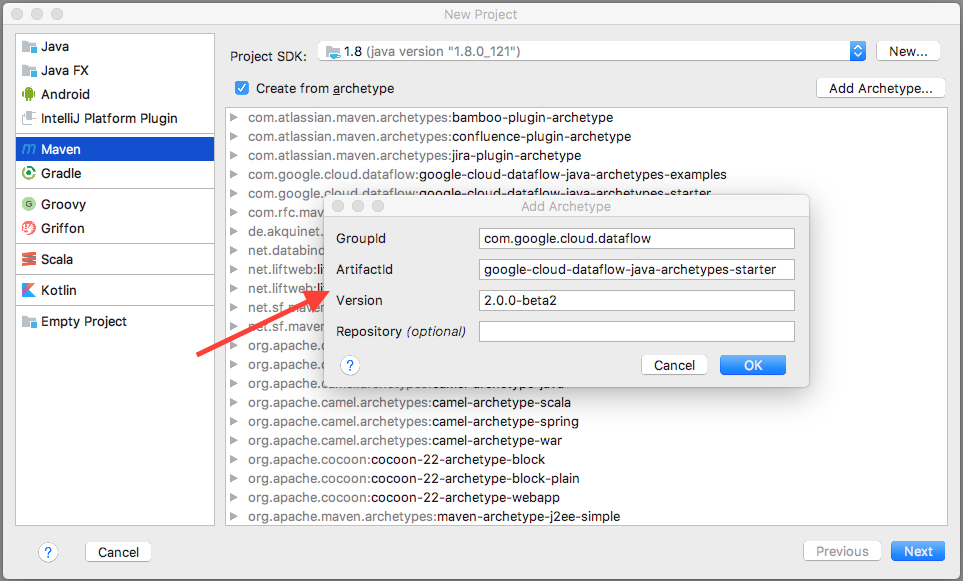
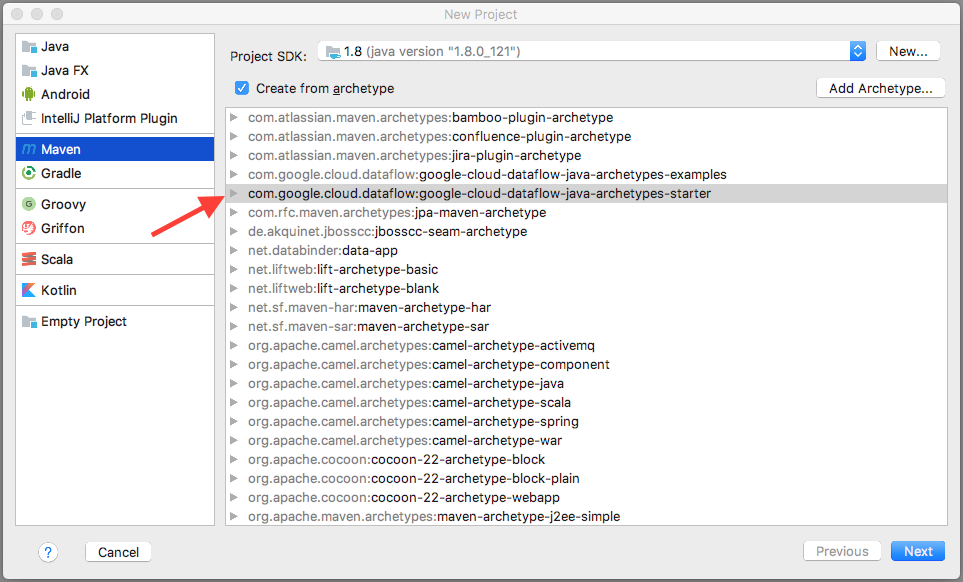

This is the Dataflow [Quickstart using Java and Apache Maven](https://cloud.google.com/dataflow/docs/quickstarts/quickstart-java-maven) adapted to IntelliJ, and also to use the StarterPipeline archetype. Why? If you use IntelliJ, it can be useful to avoid switching back and forth between your IDE and a terminal. These steps help you make that small optimization.

You'll need IntelliJ for this. I used IntelliJ IDEA 2016.3.4, Community Edition. YMMV if you're using a different version.

Please follow the steps at [before you begin](https://cloud.google.com/dataflow/docs/quickstarts/quickstart-java-maven#before-you-begin) first, then proceed with the instructions here.

Start IntelliJ and create a new project. 

Select Maven, and check the "Create from archetype" checkbox:

Next, click the "Add Archetype" button:

Click OK, and the newly added archetype should appear:

Click Next.

Now set the group and artifact IDs for your new starter dataflow project:

And click Next.

You're now presented with a confirmation dialog, showing you the parameters. If it all looks good, click Next.

Now IntelliJ will offer you the opportunity to place the project where ever you like. Check it over, and if it looks good, click Finish.

IntelliJ will now run the Maven tasks needed to create your project, which will involve some downloading of artifacts from the internet.

A little time passes, and your project should appear. In the upper left corner of IntelliJ, you can see your project pane. Expand the tree so that it looks like the below. You'll see that there's a Java class called StarterPipeline there. Feel free to click it, and take a look at the code.

Now let's configure IntelliJ to use Maven to build and deploy our pipeline.

Click **Run > Edit Configurations...** and configure a Run configuration for our pipeline. 

Once the dialog appears, click the **+** at the top left, and select Maven. 

A new dialog appears. We'll create a configuration to launch the StarterPipeline using the local dataflow runner, DirectRunner. Change the name of the new configuration. I called mine "StarterPipeline - Local Runner". Add the following command line to the Command Line text field (adjusting as needed if you named your group ID and artifact ID differently). Note that `mvn` is **not** included:

	compile exec:java -Dexec.mainClass=com.example.dataflow.StarterPipeline -Dexec.args="--runner=DirectRunner"

Save the new configuration, and you should have a new button in the upper right of your IntelliJ project window:

Click the green arrow next to it, and IntelliJ should get to work compiling and running your pipeline locally. Check the output, and you should see something like the following:

	Feb 21, 2017 12:43:06 PM com.example.dataflow.StarterPipeline$1 processElement
	INFO: HELLO
	Feb 21, 2017 12:43:06 PM com.example.dataflow.StarterPipeline$1 processElement
	INFO: WORLD
	[INFO] ------------------------------------------------------------------------
	[INFO] BUILD SUCCESS
	[INFO] ------------------------------------------------------------------------
	[INFO] Total time: 3.724 s
	[INFO] Finished at: 2017-02-21T12:43:06-05:00
	[INFO] Final Memory: 25M/317M
	[INFO] ------------------------------------------------------------------------
	Process finished with exit code 0

That's it. The job ran successfully locally, and produced the right output.

Now let's add an option to execute in Google Cloud Dataflow's Dataflow Runner. Add another configuration as above, this time modifying the name to read "Starter Pipeline - DataflowRunner", and with the following command line (the only change is to the `--runner` argument):

	compile exec:java -Dexec.mainClass=com.example.dataflow.StarterPipeline -Dexec.args="--runner=DataflowRunner"

A new option appears in the dropdown list. Click the Run button to execute it against the DataflowRunner and you should see some output like the following:

	INFO: Staging files complete: 0 files cached, 82 files newly uploaded
	Dataflow SDK version: 2.0.0-beta2
	Submitted job: 2017-02-21_09_51_26-826914163164108819
	[INFO] ------------------------------------------------------------------------
	[INFO] BUILD SUCCESS
	[INFO] ------------------------------------------------------------------------
	[INFO] Total time: 7.321 s
	[INFO] Finished at: 2017-02-21T12:51:26-05:00
	Feb 21, 2017 12:51:26 PM org.apache.beam.runners.dataflow.DataflowRunner run
	INFO: To access the Dataflow monitoring console, please navigate to https://console.developers.google.com/project/df-workshop-159315/dataflow/job/2017-02-21_09_51_26-826914163164108819
	Feb 21, 2017 12:51:26 PM org.apache.beam.runners.dataflow.DataflowRunner run
	INFO: To cancel the job using the 'gcloud' tool, run:
	> gcloud beta dataflow jobs --project=df-workshop-159315 cancel 2017-02-21_09_51_26-826914163164108819
	[INFO] Final Memory: 30M/405M
	[INFO] ------------------------------------------------------------------------
	Process finished with exit code 0

See how it staged files for you, and then submitted the dataflow job on your behalf.

If the job was submitted successfully, you should be able to see the job in the GCP console:

